# Google Calendar 連携ガイド

TimePick が Google Calendar とどう連携しているかを、フロントエンド（FE）視点でわかりやすくまとめたドキュメントです。
「認証 → スコープ追加 → 候補生成 → 面談確定 → 編集/削除」の流れと、各処理がどのファイル・API・テーブルを触るのかを図とともに解説します。

> 対象読者: このリポジトリで FE / API を触る開発者。Google Calendar API の細かい仕様を知らなくても読めるように書いています。

---

## 0. 3行サマリー

- ログインは **2段階**。最初は `openid email profile` だけで入り、Calendar 連携は **設定画面で改めて同意**（インクリメンタル認可）して `calendar.events` / `calendar.readonly` スコープを足す。
- Google のトークンは **DB の `Account` テーブル**に保存。サーバー側だけが `googleapis` SDK を使って Calendar API を叩く。**FE は Google を直接叩かない**（必ず自前の `/api/*` を経由）。
- 予定は **DB と Google Calendar の二重持ち**。書き込み系（面談確定・編集・削除）は **DB を正とし、Google 同期に失敗したら DB をロールバック**して整合性を守る。

---

## 1. 登場人物（コンポーネント相関）

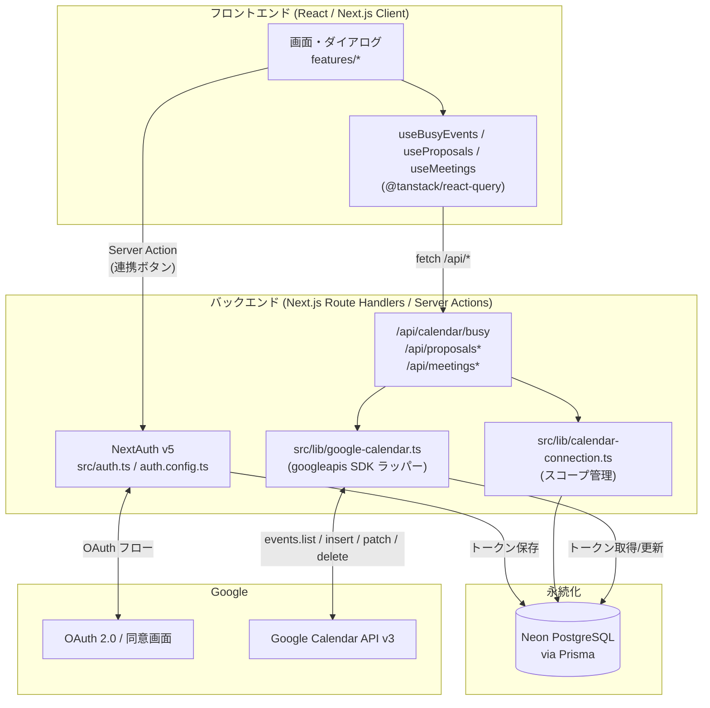

| レイヤー | 主なファイル | 役割 |
|---|---|---|
| FE 画面 | `src/features/**`, `src/app/**/page.tsx` | UI とダイアログ |
| FE データ取得 | `src/lib/use-busy-events.ts`, `use-proposals.ts`, `use-meetings.ts` | react-query で `/api/*` を叩いてキャッシュ |
| 認証 | `src/auth.ts`, `src/auth.config.ts` | NextAuth v5 設定・トークン永続化 |
| スコープ管理 | `src/lib/calendar-connection.ts` | 連携判定・インクリメンタル認可パラメータ |
| Calendar 操作 | `src/lib/google-calendar.ts` | `googleapis` SDK のラッパー（核心） |
| API | `src/app/api/**/route.ts` | FE と Calendar/DB をつなぐ |
| 永続化 | `prisma/schema.prisma` | `Account` / `Proposal` / `ProposalSlot` / `Meeting` |

---

## 2. 認証は「2段階」

ログイン時点ではカレンダー権限を要求しません。実際に Calendar を使いたくなった時（＝設定画面）に、改めて同意画面を出してスコープを足します。これが **インクリメンタル認可**です。

### 2-1. 初回ログイン（最小スコープ）

`src/auth.config.ts:10` でスコープは `openid email profile` のみ。

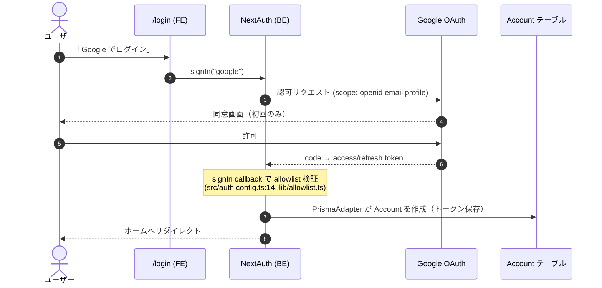

- **allowlist**: `ALLOWED_EMAILS` に載っていないメールは弾く（fail-closed）。`src/lib/allowlist.ts`。
- この時点では `Account.scope` に calendar スコープが**入っていない**ので、`hasCalendarConnection()` は `false`。

### 2-2. Calendar 連携（設定画面でスコープ追加）

`src/app/settings/page.tsx:31` の Server Action から、`CALENDAR_AUTHORIZATION_PARAMS` を付けて再度 `signIn` します。

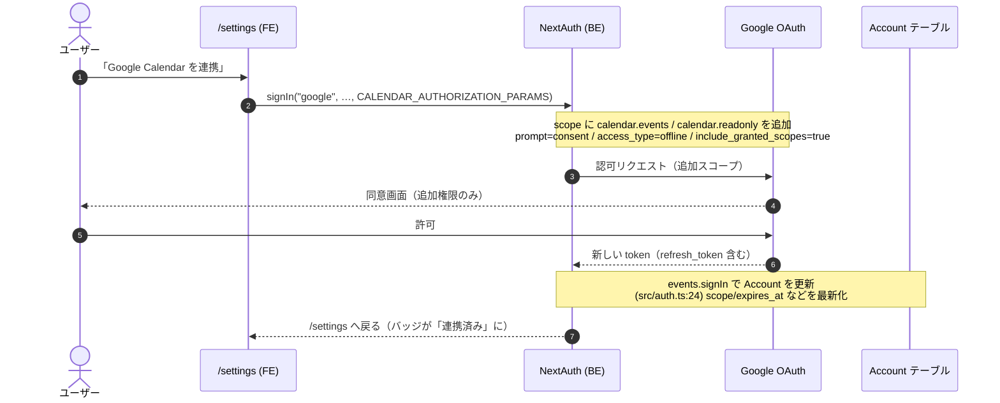

`src/lib/calendar-connection.ts:8` の認可パラメータがポイント:

| パラメータ | 値 | 意味 |
|---|---|---|
| `scope` | `openid email profile` + 2つの calendar スコープ | 読み書き(`calendar.events`)＋読み取り(`calendar.readonly`) |
| `prompt` | `consent` | 毎回同意画面を表示し refresh_token を確実に取得 |
| `access_type` | `offline` | オフライン（バックグラウンド）アクセス用 refresh_token を発行 |
| `include_granted_scopes` | `true` | 既存スコープに**追加**で積み増し（差し替えない） |

> **なぜ `events.signIn` が要るのか**: PrismaAdapter は「初回ログイン」では Account を作るが、2回目以降のサインインでトークンを自動更新しない。そのため `src/auth.ts:21-46` で明示的に `Account` を上書きしている。再認証で `refresh_token` が返ってこない場合は既存値を維持する（`account.refresh_token ?? undefined`）。

### 2-3. 連携の判定と解除

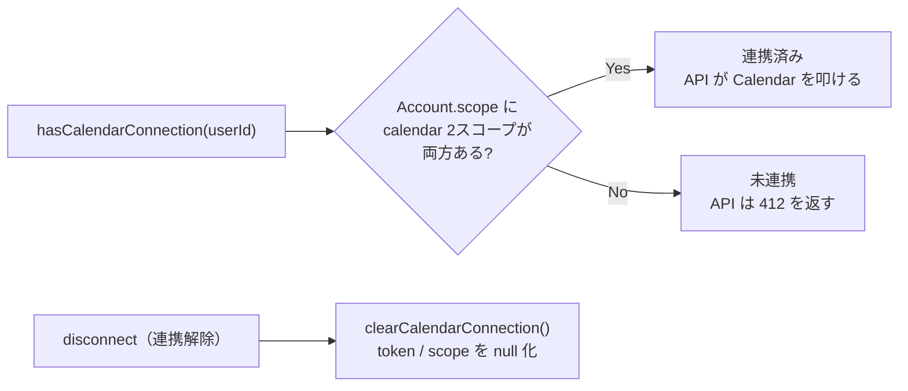

- 連携判定: `hasCalendarConnection()`（`calendar-connection.ts:18`）が `Account.scope` を文字列分割してスコープの有無を確認。
- 連携解除: `clearCalendarConnection()`（`calendar-connection.ts:25`）が `access_token` / `refresh_token` / `expires_at` / `scope` / `id_token` を `null` にする。

---

## 3. トークンの保存とリフレッシュ

Google のトークンは `Account` テーブルに入っており、Calendar API を呼ぶたびに `src/lib/google-calendar.ts` の `buildOAuth2Client()` が読み出して `googleapis` の OAuth2 クライアントに渡します。アクセストークンが切れていれば SDK が refresh_token で自動更新し、その新トークンを `tokens` イベントで受け取って DB に書き戻します。

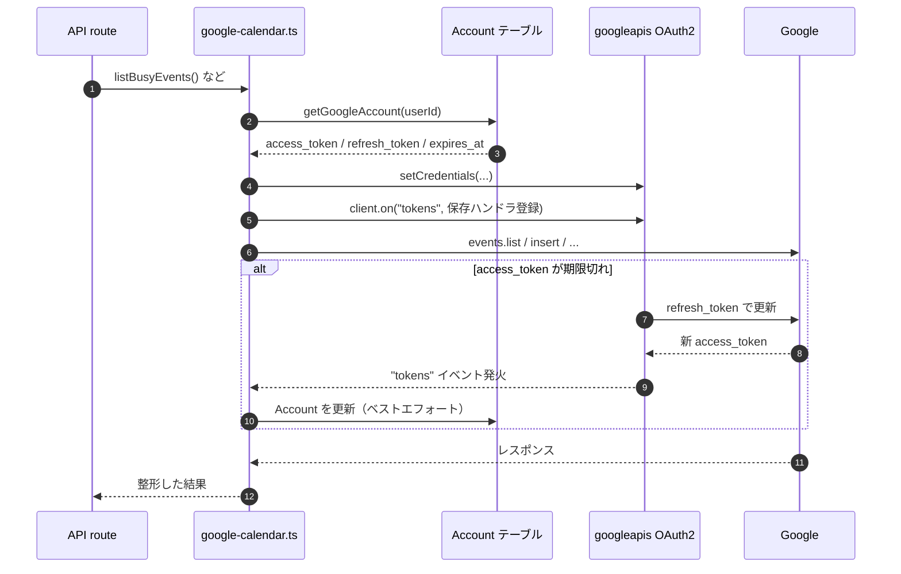

- `buildOAuth2Client()`: `google-calendar.ts:24`。`expires_at`（秒）を `expiry_date`（ミリ秒）に変換して渡す。
- トークン未保存（未連携）の場合は `null` を返し、各関数は安全に no-op（`listBusyEvents` は `[]`、insert 系は `null`）。

### `Account` テーブル（抜粋）

`prisma/schema.prisma`。

| カラム | 用途 |
|---|---|
| `provider` / `providerAccountId` | `"google"` とユーザーの Google ID |
| `access_token` | Calendar API 呼び出し用 |
| `refresh_token` | アクセストークン再発行用 |
| `expires_at` | 失効時刻（Unix 秒） |
| `scope` | 付与済みスコープ（スペース区切り）。連携判定に使う |

---

## 4. データモデル：DB と Google の二重持ち

予定は **DB（自分のアプリの真実）** と **Google Calendar（ユーザーのカレンダー）** の両方に存在し、`googleEventId` で紐づきます。

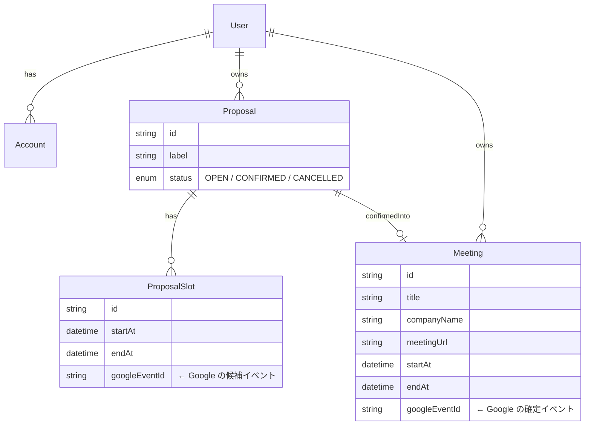

| 概念 | DB | Google Calendar 上の見た目 |
|---|---|---|
| 候補スロット (`ProposalSlot`) | `Proposal` の子。`status=OPEN` | `[候補] <label>` / 黄色(`colorId:5`) / `transparency: transparent`（空き時間にカウントしない） |
| 確定面談 (`Meeting`) | `Proposal` を `CONFIRMED` 化して紐付け | 通常の予定（タイトル・場所＝会議URL・説明あり） |
| 他人/既存の予定 | DB には持たない | Google から `events.list` で読むだけ（busy 表示用） |

---

## 5. ユースケース別フロー

FE は必ず自前の `/api/*` を経由し、API 側が `hasCalendarConnection()` でガードしてから `google-calendar.ts` を呼びます。

### 5-1. 既存予定の表示（busy）

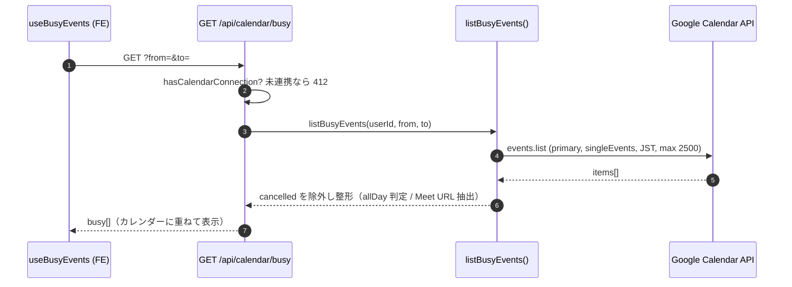

- `listBusyEvents`: `google-calendar.ts:86`。`singleEvents: true` で繰り返し予定を展開、`timeZone: "Asia/Tokyo"` 固定。
- Meet URL は `hangoutLink` または `conferenceData` から抽出（`extractMeetUrl`）。

### 5-2. 候補の生成（書き込みなし）

空き時間の計算に、Google の busy・自分の OPEN 候補・既存 Meeting の3つを「埋まっている時間」として使います。この時点では**カレンダーに書き込みません**。

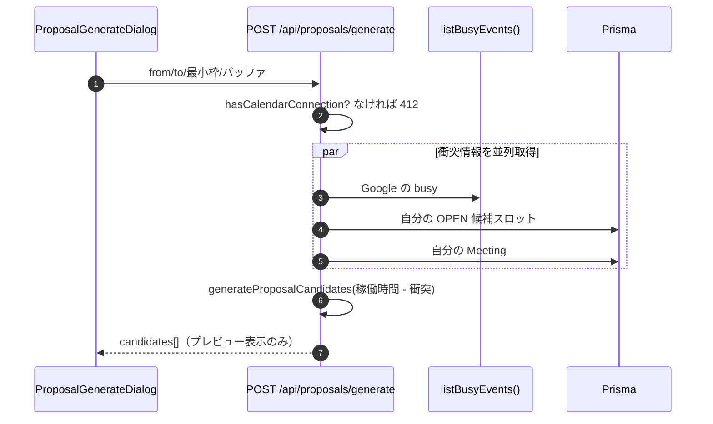

- `src/app/api/proposals/generate/route.ts:65` で3ソースを `Promise.all` 取得し、`generateProposalCandidates()`（`src/lib/proposal-generator.ts`）に渡す。
- 稼働時間・祝日スキップ・例外日は `Availability` 設定（設定画面）から読む。

### 5-3. 候補の保存（Calendar に書き込み）

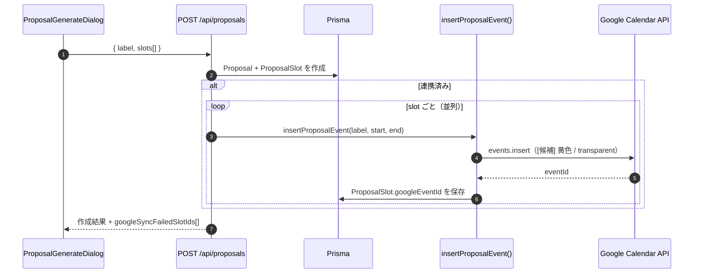

- `src/app/api/proposals/route.ts:39`。まず DB に作り、連携済みなら各スロットを Google にも登録。
- 一部スロットの同期に失敗しても処理は続行し、失敗 ID を `googleSyncFailedSlotIds` で返して FE が通知できるようにする。

### 5-4. 面談の確定（最重要：失敗時ロールバック）

候補のうち1つを確定させて `Meeting` を作り、Google に確定イベントを入れます。**Google への書き込みに失敗したら DB をロールバック**して「Google にだけ予定が残る孤児」を防ぎます。確定後は不要になった候補イベントを Google から消します。

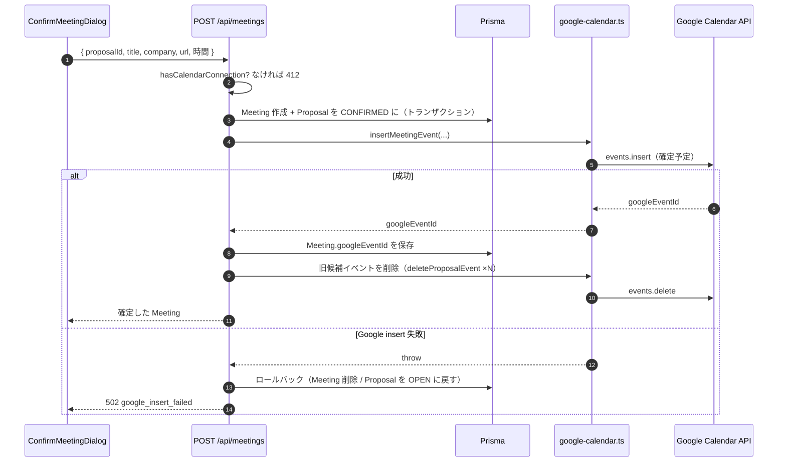

- `src/app/api/meetings/route.ts:69-131`。設計意図はコード内コメントの通り「DB を先に確定 → Google 書き込み → 失敗なら DB を巻き戻す」。
- 候補イベントの削除は `deleteProposalEvent`（実体は `deleteMeetingEvent` と同一、`google-calendar.ts:229`）。削除失敗はログのみで握りつぶす（確定自体は成功扱い）。

### 5-5. 面談の編集・削除

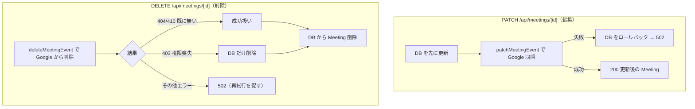

- 削除系のエラー耐性: `deleteMeetingEvent`（`google-calendar.ts:157`）は **404/410（既に消えている）を成功扱い**にする。これにより手動でカレンダー側を消していても整合する。

---

## 6. API エンドポイント早見表

| メソッド・パス | 役割 | Calendar への作用 |
|---|---|---|
| `GET /api/calendar/busy` | 既存予定の取得 | `events.list`（読み取り） |
| `POST /api/proposals/generate` | 候補の計算 | `events.list`（読み取りのみ、書き込みなし） |
| `POST /api/proposals` | 候補の保存 | `events.insert`（候補イベント） |
| `PATCH /api/proposals/[id]` | 候補ラベル更新 | `events.patch` |
| `DELETE /api/proposals/[id]` | 候補削除 | `events.delete` |
| `POST /api/meetings` | 面談確定 | `events.insert` ＋ 旧候補 `delete` |
| `PATCH /api/meetings/[id]` | 面談編集 | `events.patch` |
| `DELETE /api/meetings/[id]` | 面談削除 | `events.delete` |

> 書き込み・候補生成系は冒頭で `hasCalendarConnection()` をチェックし、未連携なら **HTTP 412 (`calendar_not_connected`)** を返します。FE はこれを見て「設定画面で連携してね」と促せます。

---

## 7. 環境変数

`.env.example` 参照。Google 連携に直接効くもの:

| 変数 | 用途 |
|---|---|
| `AUTH_GOOGLE_ID` / `AUTH_GOOGLE_SECRET` | Google OAuth クライアント。NextAuth と `buildOAuth2Client` の両方が使う |
| `AUTH_SECRET` | NextAuth のセッション署名 |
| `DATABASE_URL` | Neon Postgres（`Account` などの保存先） |
| `ALLOWED_EMAILS` | ログインを許可するメール（カンマ区切り、fail-closed） |
| `ALLOW_PUBLIC_SIGNUP` | `true` で allowlist を無効化（本番非推奨） |

> Google Cloud Console 側では、OAuth クライアントのリダイレクト URI に `…/api/auth/callback/google` を登録し、Calendar API を有効化しておく必要があります。

---

## 8. FE 開発者向け Tips

- **Google を直接叩かない**: 認証もデータ取得も必ず `/api/*` 経由。トークンはサーバーの `Account` テーブルにあり、FE には渡らない。
- **未連携の扱い**: 候補生成・確定で `412` が返ったら「設定 → Google Calendar を連携」へ誘導する。`hasCalendarConnection()` の真偽は設定画面のバッジで可視化済み。
- **キャッシュ更新**: 書き込み後は react-query の `invalidateQueries` で `busy / proposals / meetings` を更新する（各 `features/**/service.ts` を参照）。
- **部分失敗に注意**: 候補保存は `googleSyncFailedSlotIds` を返し得る。空でなければ「一部の候補がカレンダーに反映されませんでした」と通知する。
- **時刻は JST 前提**: Calendar 呼び出しは `Asia/Tokyo` 固定。FE から送る日時は ISO8601（オフセット付き）で。

---

## 付録：主要ファイル

| ファイル | 内容 |
|---|---|
| `src/auth.config.ts` | Edge 安全な基本設定・初回スコープ・allowlist |
| `src/auth.ts` | NextAuth v5 本体・`events.signIn` でのトークン更新 |
| `src/lib/calendar-connection.ts` | スコープ定義・認可パラメータ・連携判定/解除 |
| `src/lib/google-calendar.ts` | `googleapis` ラッパー（list/insert/patch/delete・トークン更新） |
| `src/app/settings/page.tsx` | 連携/解除ボタン（Server Action） |
| `src/app/api/calendar/busy/route.ts` | 既存予定取得 |
| `src/app/api/proposals/**` | 候補の生成・保存・編集・削除 |
| `src/app/api/meetings/**` | 面談の確定・編集・削除（ロールバック付き） |
| `prisma/schema.prisma` | `Account` / `Proposal` / `ProposalSlot` / `Meeting` |
